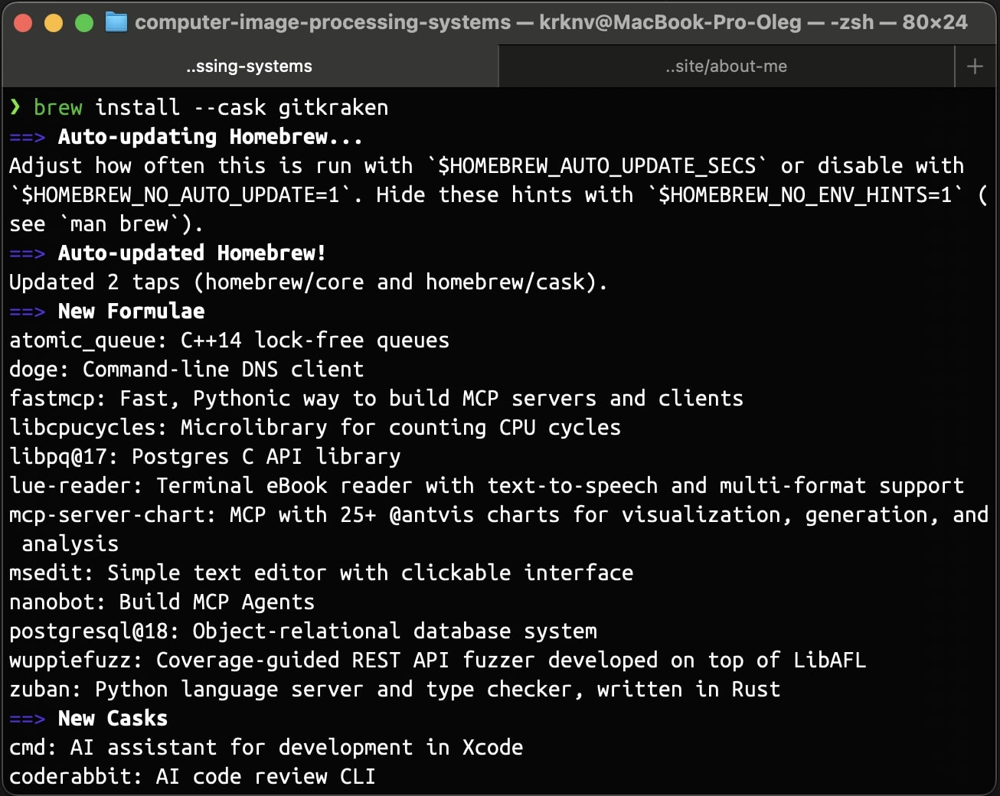
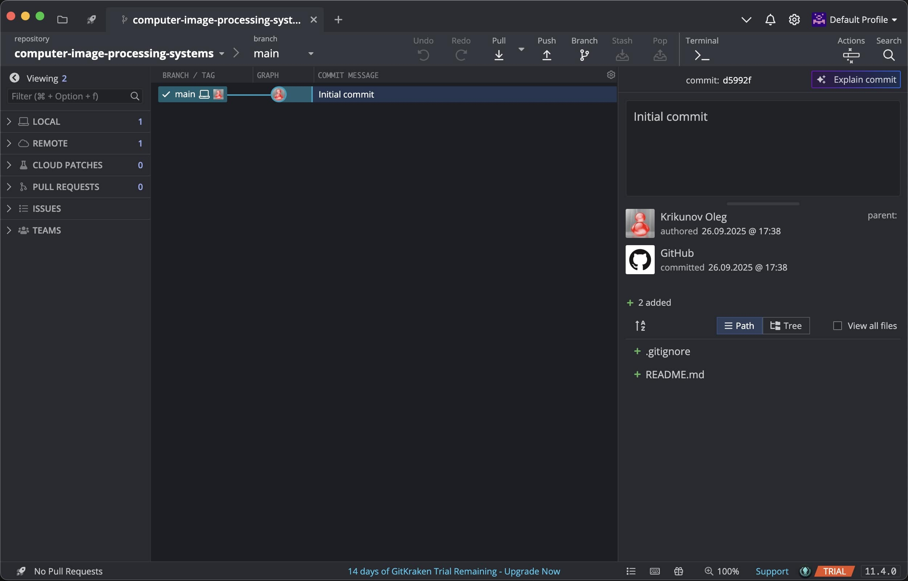
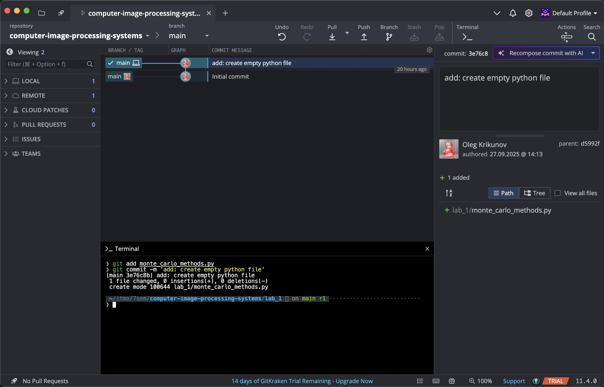
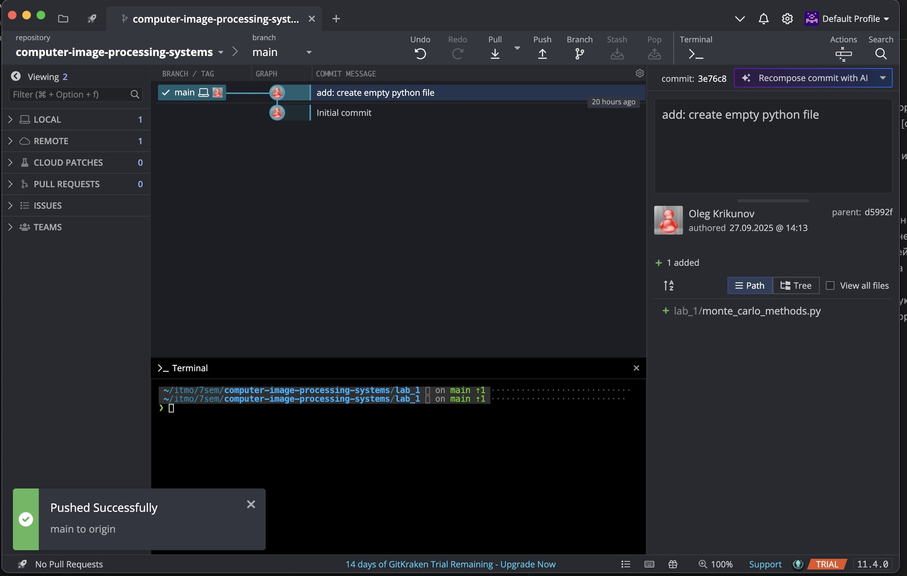
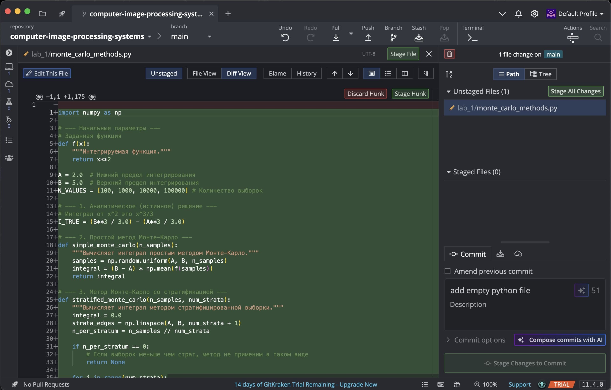
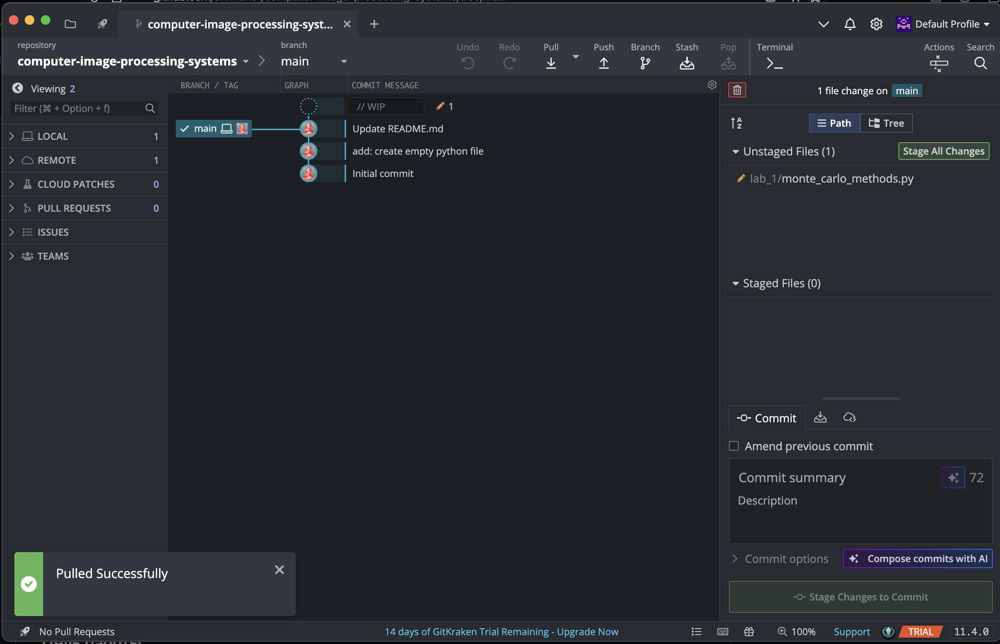
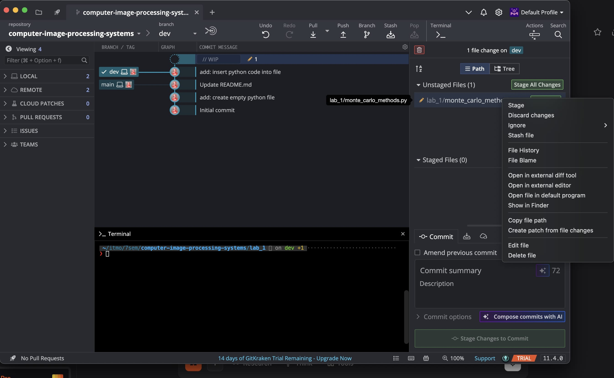
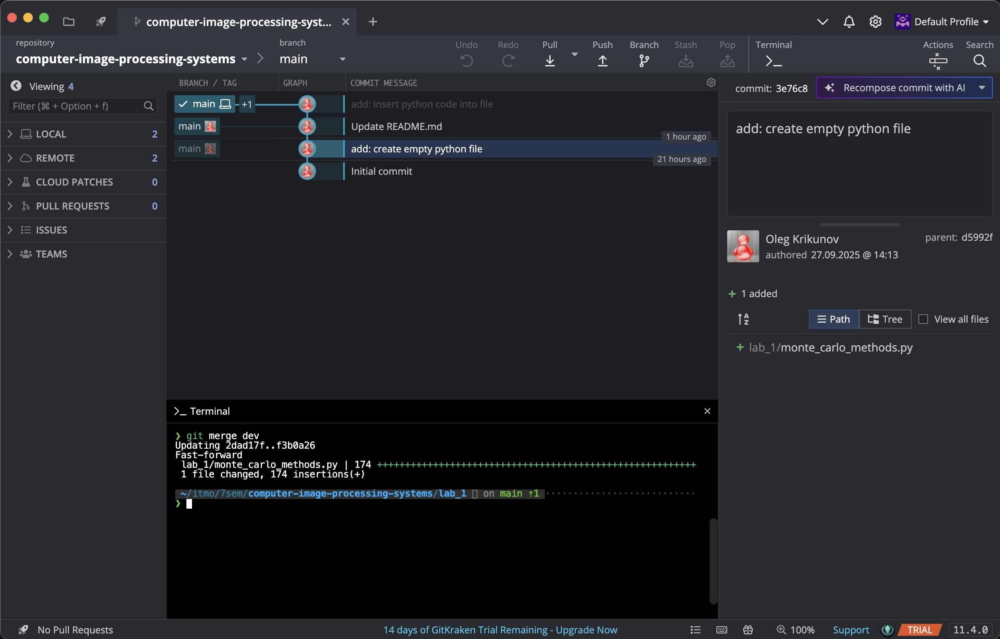

# Отчёт по работе с GitKraken

## 1. Установка и настройка
- **Установка GitKraken** через `brew`:
  
- **Авторизация** в аккаунте GitHub для синхронизации репозиториев.

## 2. Работа с репозиторием
- Открыт **приватный репозиторий** по предмету *«Системы компьютерной обработки изображений»*:
  *На данном этапе в репозитории присутствует только файл `README.md` и один коммит.*
  

## 3. Добавление новых файлов
- Созданы **папка и Python-файл** в локальном репозитории.
- **Обнаружение изменений** в GitKraken:
  *Интерфейс автоматически отобразил новые незакоммиченные файлы.*

## 4. Коммит и пуш изменений
- **Проблема с коммитом через интерфейс**:
  Не удалось сразу разобраться, как закоммитить изменения через GitKraken, поэтому использовал консоль:
  ```bash
  git add monte_carlo_methods.py
  git commit -m "add: create python file"
  ```
- **Отображение изменений** в GitKraken:
  Появилось ответвление с иконкой ноутбука, сигнализирующее о локальных изменениях:
  

- **Пуш изменений** через интерфейс GitKraken:
  Нажатием кнопки **`Push`** изменения были отправлены на удалённый репозиторий:
  

## 5. Редактирование файлов и просмотр изменений
- Добавлен **код в Python-файл** через `Vim`.
- **Просмотр различий** (`git diff`) в интерфейсе GitKraken:
  

## 6. Тестирование `git pull`
- Изменён **README.md** напрямую через GitHub.
- **Пул изменений** через интерфейс GitKraken:
  

## 7. Работа с ветками
- Создана **ветка `dev`** и добавлены изменения в Python-код.
- **Проблема переключения на `main`**:
  GitKraken заблокировал переключение из-за незакоммиченных изменений.
  *Решение:* Использование `git stash` для временного сохранения изменений:
  ```bash
  git stash
  ```
  
  После этого переключение на `main` стало возможным.

- **Слияние веток (`git merge`)**:
  Не удалось выполнить через интерфейс, поэтому использовал консоль:
  ```bash
  git merge dev
  ```
  
  Результат слияния отобразился в GitKraken.

## Выводы
- **GitKraken** удобен для визуализации истории коммитов, веток и изменений.
- **Некоторые операции** (например, `merge` или разрешение конфликтов) проще выполнять через консоль.
- **Интерфейс** интуитивно понятен для базовых операций (`push`, `pull`, переключение веток).
