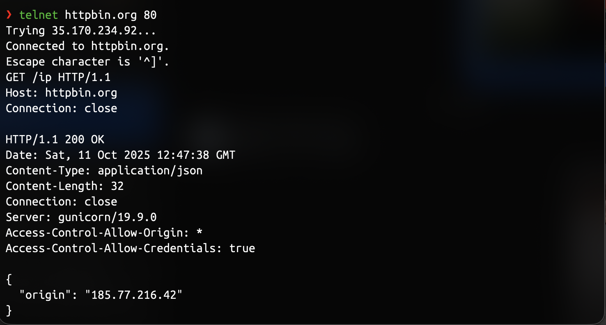
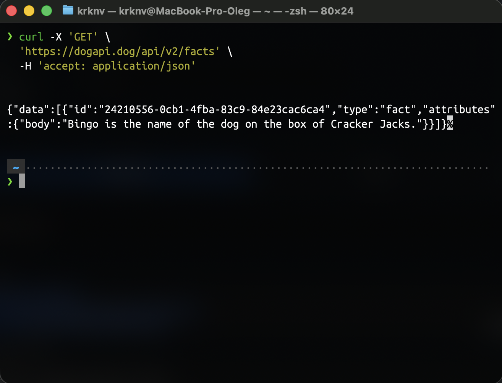
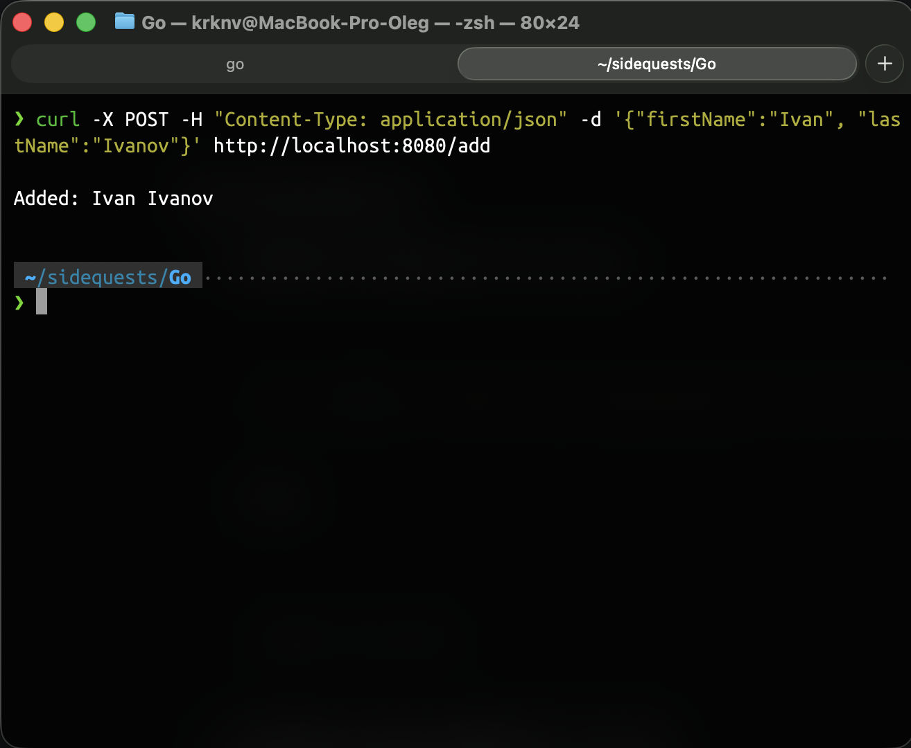
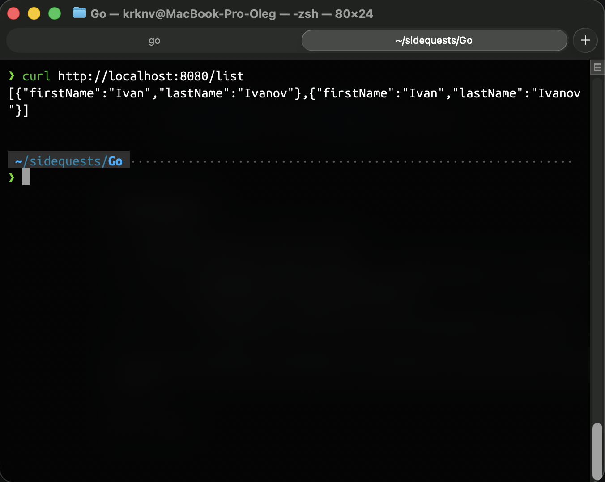
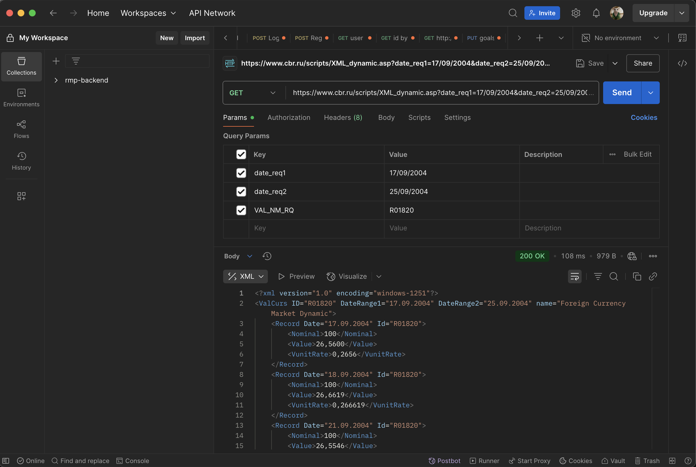

**1. Пример использования GET запроса через telnet**   
  Обратимся к сайту ```httpbin.org``` на 80 порт   
  

**2. Пример использования GET запроса через cURL**   
  Я взял API со случайными фактами про собак
     
  Я не смог найти публичный сервис для тестирования POST запроса, поэтому написал простой веб-сервер на Go, который принимает имя и фамилию и записсывает в массив.   
  Пример использования POST запроса через cURL   
     
  Теперь отправим GET запрос, чтобы удостовериться в том, что Ivan Ivanov действительно был добавлен в массив
     
  Как мы видим все успешно (я два раза вызвал POST, поэтому там два Ивана Иванова)   

  **3. GET-запрос для получения курса йены с 17 по 25 сентября 2004 года**   
     
  GET-запрос успешно возвращает данные в XML формате